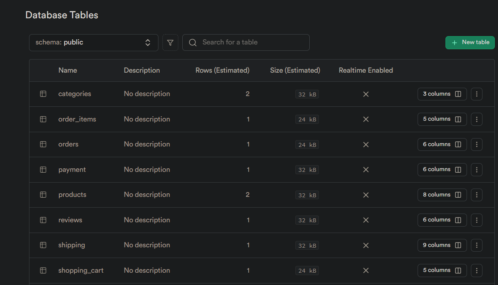

# Structured Ecommerce Database Design
## Project Overview
This project demonstrates my ability to conceptualize, design, and implement a well-structured relational database using PostgreSQL. The database is built to support the core functionality of a typical e-commerce platform, managing entities like users, products, orders, payments, and more. The repository includes everything needed to deploy and test the database, including Docker files to create the database container, an SQL script for initializing the schema, and a UML diagram that visually represents the database structure.

## Objectives
The goal of this project is to demonstrate the following skills:

- **Database Design & Conceptualization**: Ability to create a structured and efficient relational database for an ecommerce platform.
- **Relational Data Modeling**: Crafting tables and defining their relationships using proper cardinalities and action verbs.
- **SQL Schema & Deployment**: Writing an SQL script to deploy the database with correctly defined relations and constraints.
- **Use of UML Diagrams**: Visualizing the data structure through an UML diagram for better understanding and documentation.

## Project Structure
The project is structured as follows:

- **init_base.sql**: This script initializes the database by creating tables, defining relationships, and adding constraints like primary and foreign keys.
- **ressources/ecommerce_uml_diagram.png**: A visual representation of the database schema using an UML diagram to depict the relationships and cardinalities between the tables.
- **Dockerfile & docker-compose.yml**: These files are used to create a Docker image of the fully initialized and ready-to-use database.

## Database Tables
The database includes the following tables:

  1) **Users**: Stores customer information.
  2) **Products**: Contains details about available products.
  3) **Categories**: Classifies products into categories.
  4) **Orders**: Manages orders placed by users.
  5) **Order_Items**: Tracks the products included in each order.
  6) **Payments**: Handles payment information for orders.
  7) **Shipping**: Manages the shipping details of orders.
  8) **Reviews**: Stores user feedback and ratings on products.
  9) **Shopping_Cart**: Temporarily holds items for users before purchase.

### Below is the UML diagram illustrating the database structure:


## How to Use
  1) Clone the repository:
```bash
git clone https://github.com/BenoitAd/Database-Conceptualization-PostgreSQL.git
```
  2) Open init_base.sql and execute the script on a PostgreSQL database to set up the schema.
  3) View the ecommerce_uml_diagram.png file to understand the database relationships.

## How to Deploy with All-in-One Tools
You can easily deploy this database using tools like Supabase, which simplifies hosting and managing PostgreSQL databases. 

Simply run the provided initialization script (init_base.sql) by following their documentation. Here's a sample view of how the tables will look in Supabase:


## Deploy Locally or on Your Personal Server with Docker
To deploy the database locally or on your own server, ensure that Docker is installed and running on your machine. Then, follow these steps:

  1) Navigate to the project directory containing the docker-compose.yml file.
  2) Run the following command to start the PostgreSQL container:
```bash 
docker-compose up
```
This will initialize and run the database using Docker.

## Test Locally
Once the database is deployed locally using Docker, you can connect to it using any PostgreSQL client, such as:

  - pgAdmin
  - psql (PostgreSQL command-line tool)
  - DBeaver (Database management tool)

Connection Details:
  - Host: localhost
  - Port: 5432
  - User: admin
  - Password: admin
  - Database: ecommerce_demo
  
You can modify these connection details by editing the docker-compose.yml file to suit your preferences.

## Next Steps
Future updates to this project may include adding stored procedures, optimizing queries, and integrating the database with an API or frontend.
